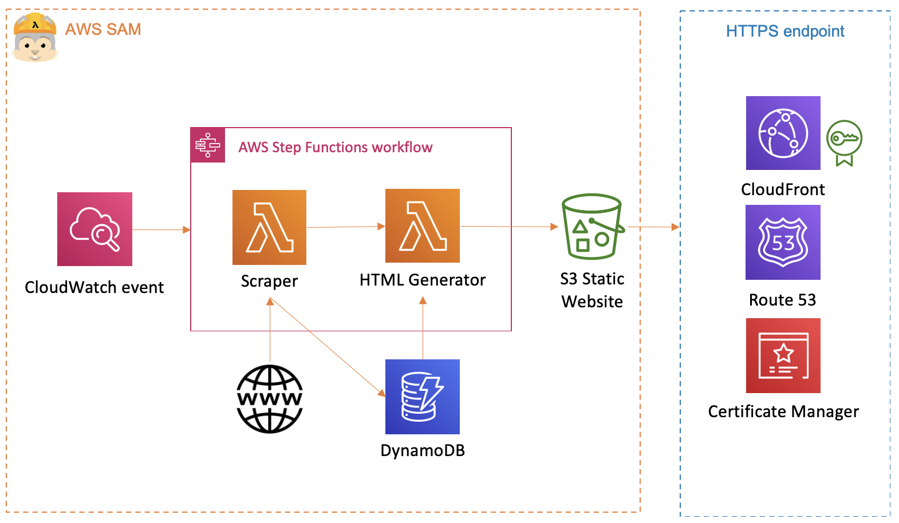

# Lunch@Axis scraper
This is a [Rube Goldberg machine](https://en.wikipedia.org/wiki/Rube_Goldberg_machine) intended to give you an idea about what's for lunch around the Axis HQ in Lund, Sweden.

See if it works! [Lunch@Axis](https://lunch.axis.cloud/)

## Adding restaurants
If you think there's a restaurant missing, or you want to adopt this to your own liking, it's easy to expand on using the [Abstract Base Class](https://docs.python.org/3/library/abc.html) `AbstractRestaurant.py` and adding a new restaurant to `restaurants.csv`.

Currently, [Beautiful Soup](https://www.crummy.com/software/BeautifulSoup/) is used to scrape pages of restaurants but you can use whatever you want as long as a `dict` containing the days of the week is returned when method `get_week_menu` is invoked. Example:

```python
example_menu  = ExampleRestaurant().get_week_menu('https://www.restaurant.com/')
print(json.dumps(example_menu, indent=4))
```

yields...

```json
{
    "ExampleRestaurant": {
        "mon": "monday food",
        "tue": "tuesday food",
        "wed": "wednesday food",
        "thu": "thursday food",
        "fri": "friday food",
        "url": "https://www.restaurant.com"
    }
}

```

## Deploying with GitHub Actions
1. Clone the repo
2. Create your own repo on GitHub and push the cloned one to yours
3. Configure Github Secrets for the following paramaters:
* `BUCKET`: The name of the master branch S3 bucket. Must be a non-existing and unique name
* `BUCKET_DEV`: The name of the dev branch S3 bucket. Must be a non-existing and unique name
* `CLOUDFRONT_OAI`: The Cloudfront Access Origin ID
* `CLOUDFRONT_ID`: The Cloudfront Distribution ID
* `DDB_TABLE`: The name of the DynamoDB table used by Lambda functions in the master branch
* `DDB_TABLE_DEV`: The name of the DynamoDB table used by Lambda functions in the dev branch
* `DEFAULT_REGION`: The AWS region you want to deploy in
* `ROLENAME`: The name of the IAM role used by Lambda in the master branch
* `ROLENAME_DEV`: The name of the IAM role used by Lambda in the dev branch
* `SAM_S3_BUCKET`: The name of the S3 bucket SAM uses to store packages in
* `AWS_ACCESS_KEY_ID`: Access key for the AWS account where you want to deploy. Must have admin privileges for first deployment or else SAM can't create IAM role needed.
* `AWS_SECRET_ACCESS_KEY_ID`: Secret Access key for the AWS account where you want to deploy. Must have admin privileges for first deployment or else SAM can't create IAM role needed.
* `STACK_NAME`: The name of the Cloudformation stack in the master branch
* `STACK_NAME_DEV`: The name of the cloudformation stack in the dev branch
3. When a **commit** is made to the **dev branch**, Github will automatically deploy the changes to the Cloudformation stack specified in the `STACK_NAME_DEV` parameter
4. When a branch is **merged** into the **master branch**, Github will automatically deploy the changes to the Cloudformation stack specified in the `STACK_NAME` parameter

## Deploying manually

### Requirements
* AWS SAM
* Docker desktop
* Python 3.8

### Instructions

1. Run command `sam build --use-container` (requires Docker)
2. Run command `sam deploy --guided` and save the config as a samconfig.toml file. You may need to modify the `samconfig.toml` to use `capabilities = "CAPABILITY_NAMED_IAM"`, or SAM might fail when creating new IAM roles
3. If no existing Cloudfront distribution is specified the S3 bucket should automatically be configured as a static website with a publically accessible URL

### Cloudformation parameters
The following parameters can be specified when deploying using `sam deploy --guided`
* `RoleName`: The IAM role used by Lambda functions
* `HTMLBucket`: The name of the S3 bucket which will host the static web content. Cannot be an existing S3 bucket and must be globally unique
* `DDBTableName`: The name of the DynamoDB table where menus will be stored
* `DDBTTLEnabled`: If specified to `true`, records will be deleted after a period of time from the DynamoDB table
* `CloudfrontDistribution`: Specifies if you should use an existing Cloudfront distribution or not. The template does not create a distribution itself, it must be an existing distribution.
* `CloudfrontOriginAccessId`: If `CloudfrontDistribution` is set to `true`, specify the 12 digit Cloudfront Access ID here to restrict the S3 bucket to only server content to the S3 bucket

## Architecture

* Step functions set on a cloudwatch schedule to run Mon-Fri 09:00 - 12:00
  * The scraper lambda function attempts to fetch menus from each restaurant specified in `restaurants.csv` and places the results in a DynamoDB table
  * The HTML generator Lambda function fetches latest results from DynamoDB and attempts to generate a HTML page, the result is put in an S3 bucket
* If Cloudfront is enabled, the S3 bucket has a bucket policy only allowing traffic to be served from Cloudfront



